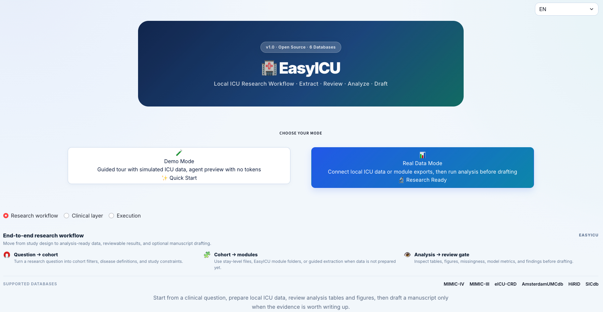
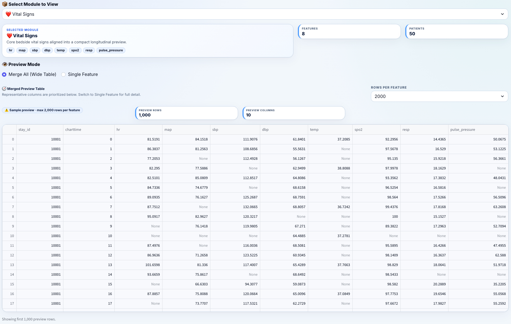
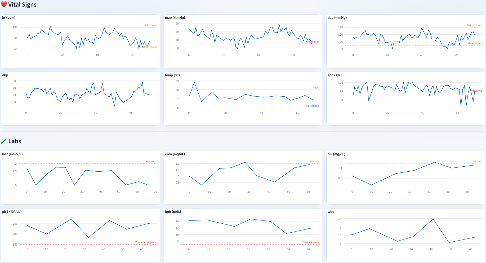
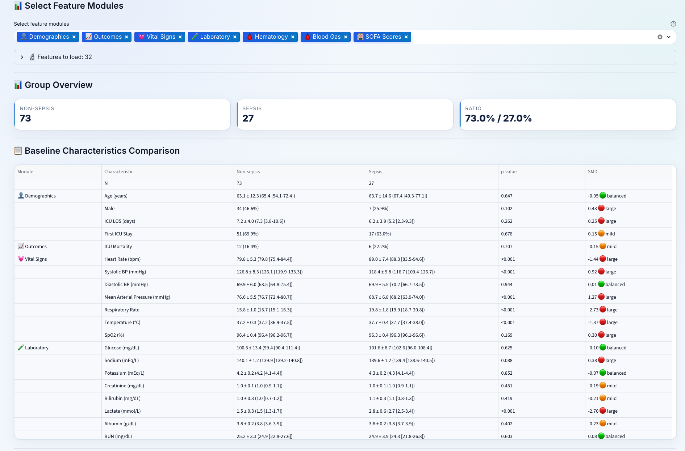
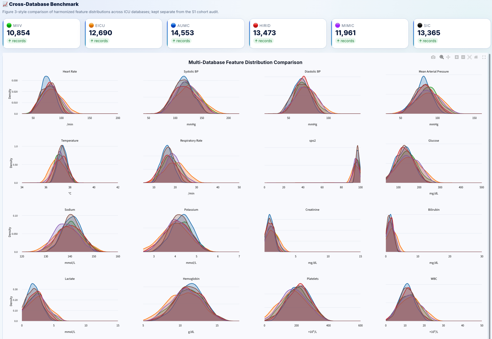
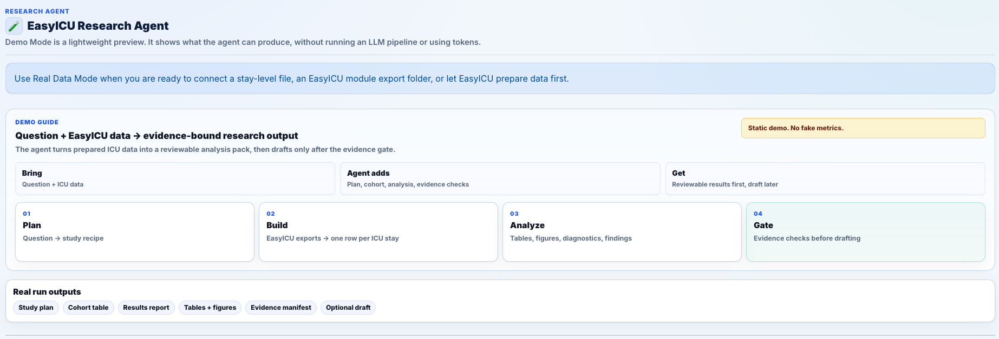

[**English README**](README.md)

# EasyICU

> 面向跨公开 ICU 数据库研究的可复现基础设施：标准化临床概念提取、面向临床用户的 Web 工作流、可编程的 Python API，以及一个**证据绑定研究 Agent**——让每个被报告的数字都可追溯，并把无法核验的声明在稿件边界拦下。

[](https://www.python.org/downloads/)
[](https://opensource.org/licenses/MIT)
[](https://github.com/shen-lab-icu/easyicu)

EasyICU 是一个面向重症监护室（ICU）数据分析的 Python 工具包。它统一接入 **6 个主流公开 ICU 数据库**，支持 **200+ 种标准化临床概念**的自动提取（Web 端目录共 **217 个** —— 204 个字典概念加上 13 个专用概念：10 个 KDIGO AKI 分期输出、2 个循环衰竭指标和 Sepsis-3 SOFA-1 诊断，全部都能通过同一个 `load_concepts(...)` 调用获取），并提供 **Web 可视化界面**，帮助用户完成队列定义、特征审阅、可视化分析与数据导出。

## 为什么是 EasyICU

EasyICU 有两层，对应同一个问题的两半——*一个被报告的 ICU 结果有多可信？* **概念层**约束「产生这个数字的临床定义」，**证据绑定 Agent 层**约束「记录这个数字的证据链」。

- **用一套临床概念层覆盖六个公开 ICU 数据库**：EasyICU 以临床概念而不是数据库专属变量表作为核心抽象，更适合跨数据库研究、复用和同行审阅。跨库分析的单位是「概念」（`hr`、`crea`、`sofa2`…），而不是某个数据库的私有字段名。
- **同时支持代码与图形界面的可复现工作流**：同一份准备完成的数据既可用于 Web 界面，也可用于 Python 脚本和 notebook。
- **证据绑定、可审计的分析 Agent**：可选的 research-agent 层把「问题 + 队列」变成可审计的分析——每个产物（脚本、日志、表格、统计量、图形）都以 SHA-256 登记进证据库，每个被报告的数字都会和其登记值比对。无法核验的声明会在**稿件边界被拦下**而不是直接发表——即 *fail-closed* 设计。
- **用跨库复制验证可靠性**：同一个研究问题可作为 replication protocol 在多个数据库上各跑一遍，让一个结论的稳健性可以被*检查*，而不是被假定。
- **围绕有临床意义的研究任务设计**：框架内置 **SOFA-2** 自动计算，并提供标准化概念提取、专业模块和队列分析能力。

## 这个仓库适合谁

- **审稿人和临床研究者**：希望快速理解项目贡献，以及它如何支持 ICU 研究工作流。
- **Web 用户**：希望不写代码就完成数据校验、队列定义、特征审阅和导出。
- **Python 用户**：希望通过脚本或 notebook 构建可复现的特征提取与队列分析流程。

## 从这里开始

> **调用任何 API 前的唯一铁律：** 所有提取 API 接收的都是**已转换（prepared）**的数据集，而不是原始下载包。如果你还没转换过这个数据库，请**先做转换**（Web 界面 *Validate Data Path → Convert & Setup*，或 `DataConverter(...).convert_all()` —— 见 [Python API](#-python-api)）。下文每个示例里的 `data_path` 指的都是*转换后的目录*。

### 快速查表:"我想…… → 运行……"

| 目标 | 入口 |
|------|------|
| 不写 Python,可视化校验数据 / 定义队列 / 导出特征 | **FastAPI 原生 Web 应用** — `easyicu-webapp` *(或 `./start_easyicu.sh` / `start_easyicu.command`)* —— 见 **路线 A** |
| 用 Python 构建可复现的特征/队列流水线 | **Python API** — `import easyicu` —— 见 **路线 B** |
| 用 CLI 跑特征提取(脚本化、无 UI) | `easyicu`(对应 `extract_features` 控制台脚本) |
| 让 research-agent 跑一个研究问题 + 队列 | `easyicu-research-agent` |
| 用 agent 复现一篇外部论文 | `easyicu-research-replication` |
| 启动 research-agent 用的 LLM 代理服务 | `easyicu-llm-server` |
| 可直接复制运行的脚本 | [`examples/`](examples/) —— 从 [`quickstart_convert_and_load.py`](examples/quickstart_convert_and_load.py) 开始 |

所有控制台脚本都在 `pyproject.toml` 的 `[project.scripts]` 里声明,安装本包后即可使用 —— 安装方式（使用版 / 开发版）见 **[路线 B](#路线-bpython-api)**。

### 文档地图

本 README 是入口。每个主要分层都在自己代码旁维护一份聚焦的 README：

| 阅读 | 用于 |
|------|------|
| [`src/easyicu/README.md`](src/easyicu/README.md) | 包级模块地图——~75 个模块如何分层(概念抽象 → 转换 → API → 评分)。代码贡献者从这里开始。 |
| [`docs/native_fastapi_webserver.md`](docs/native_fastapi_webserver.md) | 当前维护的 FastAPI 原生 WebApp 路径与本地 route/API QA 命令。 |
| [`src/easyicu/research_agent/README.md`](src/easyicu/research_agent/README.md) | 证据绑定的 research-agent 层:四层设计、就绪检查、跨库复现协议。 |
| [`src/easyicu/data/README.md`](src/easyicu/data/README.md) | 驱动跨库提取的概念字典(`concept-dict.json` 与 SOFA-2 overlay)。 |
| [`CONTRIBUTING.md`](CONTRIBUTING.md) | 提交改动时的预期工作流。 |

### 路线 A：FastAPI 原生 Web 界面

如果你想：
- 快速启动 EasyICU
- 用可视化方式完成数据准备
- 不写 Python 直接定义队列并导出特征

推荐入口：
- **Windows**：双击 `start_easyicu.bat`
- **macOS**：双击 `start_easyicu.command`
- **Linux**：运行 `./start_easyicu.sh`

首次启动会在 `.easyicu-runtime/` 下自动创建本地运行环境，并安
装 Web 所需依赖。当前这条路径建议使用 Python 3.10+。

默认本地地址：

```text
http://127.0.0.1:8765
```

### 路线 B：Python API

如果你想：
- 在脚本或 notebook 中调用 EasyICU
- 自动化特征提取流程
- 在代码里构建可复现的队列管线

当前打包依赖建议使用 Python 3.10+。

**直接安装使用**（无需 clone）：

```bash
pip install "easyicu[webapp] @ git+https://github.com/shen-lab-icu/easyicu.git"
```

按需替换方括号里的 extra：

| 你想要…… | 安装 |
|----------|------|
| Python API —— 提取概念、SOFA / SOFA-2、sepsis-3、各类评分 | `easyicu` |
| FastAPI 原生 Web 应用（provider 状态工具默认休眠） | `easyicu[webapp]` |
| Plotly / Kaleido 图表导出 | `easyicu[viz]` |
| 托管 research-agent 的 LLM 代理 | `easyicu[llmserver]` |
| 可选的 LangGraph agent graph | `easyicu[agentic]` |
| 当前 active extras | `easyicu[all]` |

**核心安装（`easyicu`）已内置 research-agent 的分析栈**（`scikit-learn`、`statsmodels`），
所以 Python API 和确定性 agent 路径开箱即用。research-agent CLI 另需一个 LLM 客户端
—— 装 `easyicu[webapp]`（内含 `openai`）或运行 `easyicu-llm-server` 即可。

**克隆开发**（可编辑安装）：

```bash
git clone "https://github.com/shen-lab-icu/easyicu.git"
cd easyicu
python -m venv .venv
source .venv/bin/activate   # Windows: .venv\Scripts\activate
python -m pip install --upgrade pip
pip install -e ".[all]"
```

如需手动启动原生 Web 应用：

```bash
easyicu-webapp
```

旧 Streamlit 包已经从 active package boundary 删除。如需归档复核，只能从
Stage27 之前的 git 历史或本地 Stage27 archive patch 恢复。

## 可复现性与安全说明

- **准备完成的数据是统一契约**：原始 CSV / CSV.GZ / tar.gz 数据需先转换，再供 Web 界面和 Python API 共用。
- **AI 助手默认关闭**：只有在用户显式启用后才会工作。
- **始终保留人工确认**：队列、特征、数据转换与导出等关键操作仍需用户确认。
- **仓库已包含自动化检查**：GitHub Actions 在 Python 3.10、3.11 和 3.12 上运行 `ruff check src tests` 与 `pytest -q`，覆盖基础仓库契约与公共 API；当前维护的 Web UI gate 是 FastAPI 原生路径。

## 论文、引用与可复现

- **软件引用**：GitHub 引用元数据已写入 [CITATION.cff](CITATION.cff)。
- **给审稿人的仓库入口**：当前 README 已按“项目贡献、支持数据库、最短复现路径”的顺序组织。
- **可复现使用路径**：Web 用户可直接使用一键启动；Python 用户可在完成数据准备后复用下方 API 示例。
- **论文链接**：论文或预印本公开后，可在这里补充正式链接。

## 支持的公开 ICU 数据库

| 数据库 | 地址 |
|--------|------|
| MIMIC-III | https://physionet.org/content/mimiciii/ |
| MIMIC-IV | https://physionet.org/content/mimiciv/ |
| eICU-CRD | https://physionet.org/content/eicu-crd/ |
| AmsterdamUMCdb | https://amsterdammedicaldatascience.nl/ |
| HiRID | https://hirid.intensivecare.ai/ |
| SICdb | https://physionet.org/content/sicdb/ |

## Web 工作流总览

1. **准备 ICU 数据**并放到本地目录。
2. 在 Web 界面中执行 **Validate Data Path**。
3. 如检测到原始文件，使用 **Convert & Setup** 完成数据准备。
4. 定义研究队列、选择特征并导出结果。
5. 使用内置可视化与队列分析页面进行审阅。

### 模式选择

启动后，EasyICU 先让用户选择工作模式。**Demo Mode（演示模式）** 基于模拟 ICU 数据进行向导式体验，无需任何 token；**Real Data Mode（真实数据模式）** 连接本地准备好的数据集（或任一支持的公开数据库），运行完整的提取与审阅工作流。



### 数据准备

在 Real Data Mode 中，EasyICU 自动校验原始数据库目录并完成提取前的准备。Web 工作流会识别 CSV / CSV.GZ / tar.gz 等原始布局，将其转换为 Parquet，执行数据库专用优化，并准备 Web 界面与 Python API 共用的数据结构。

### Patient Review — 模块与特征

**Patient Review（患者审阅）** Tab 按模块（生命体征、化验、SOFA、Sepsis、AKI 等）加载概念表，让审阅者检查特征、时间序列、单患者总结，以及内置的数据质量审计。每个模块都会展示其映射的原始字段和概念层定义，并支持「合并宽表」与「单特征」两种预览模式。



### 时间序列审阅 — Clinical Lanes

**Time Series（时序）** 子标签支持 Clinical Lanes（多特征面板 + 临床阈值线）、Single Patient、Multi-Patient Comparison 三种视图。每张图都叠加了临床上有意义的阈值线 —— 例如心率上的 Tachycardia / Bradycardia，温度上的 Fever / Hypothermia，血小板上的 Thrombocytopenia —— 让审阅者一眼即可识别趋势是否需要进一步关注。



### Cohort Statistics

**Cohort Statistics（队列统计）** Tab 输出分组对照表（含 p 值与 SMD）、覆盖度与入组审计、单页队列快照，以及 SOFA-1 vs SOFA-2 敏感性分析 —— 全部基于已准备的 Demo 或真实数据状态。下方的 Baseline Characteristics 表逐模块展示对照组数值，并标注 balanced / mild / large 的显著性等级。



### Cross-Database Benchmark

**Cross-DB Benchmark（跨库对照）** Tab 把同一组临床概念在六个支持的 ICU 数据库间标准化对齐，并叠加其分布以直接对比。这里的 "Benchmark" 是 Web 界面中的探索性对照与质量检查入口，不代表正式模型排行榜或外部 benchmark 结论。



## 可视化与分析

EasyICU Web 主界面包含 5 个顶级 tab：

- **Tutorial（教程）** — 数据准备工作流向导（数据源 → 队列 → 概念 → 导出），作为最左侧顶部 tab，新用户进来就能找到，不必再去侧边栏；侧边栏的「📚 工作流帮助」也依然可用。
- **Patient Review（患者审阅）** — 数据表浏览、带临床阈值的时间序列、单患者概览、数据质量审计（缺失 / 物理范围越界 / 时间完整性）。
- **Cohort Statistics（队列统计）** — 分组对照表（含 p 值与 SMD）、覆盖度与入组流程审计、队列单页快照、SOFA-1 与 SOFA-2 敏感性分析。
- **Cross-DB Benchmark（跨库对照）** — 多数据库间的标准化特征分布对比（独立出来是因为它需要 ≥ 2 个数据库的原始 schema）。
- **Research Agent（研究智能体）** — 可选模块：以研究问题为入口的分析与证据绑定稿件框架生成，内置确定性的论文复现入口。

Research Agent 把"问题 + EasyICU 准备好的数据"通过 4 阶段流水线 **Plan → Build → Analyze → Gate** 变成证据绑定的研究产物，并只在 Evidence Gate 通过后才生成可审稿件框架；它不是全自动论文写作或自主科学发现系统，也不是临床决策支持工具。



## 证据绑定 Research-Agent 层

`easyicu.research_agent` 是一个可选层，把研究问题 + 已确认的队列导出变成**可审计**的分析。它不是标准 Web 工作流或 Python 提取 API 的必需部分。完整设计见
[src/easyicu/research_agent/README.md](src/easyicu/research_agent/README.md)。

**为什么它不只是「编排」。** 通用分析 agent 擅长规划和写代码，但弱于 ICU 语义——会把有序的 SOFA 子分当连续量平均、把缺失的 PaO₂ 静默填补、掉进 `SOFA==0` 高死亡率假象、把 ICU 死亡和院内死亡混用。EasyICU 用四层来补这个缺口：

1. **ICU 数据底座** —— 复用上面的概念字典，作为 agent 对数据的*唯一*视图（它不通过 prompt 看到原始行，因此无法发明变量或非法聚合）。
2. **安全分析运行时** —— SHA-256 `EvidenceStore`、数值声明注册表、确定性验证器、执行回放。
3. **Agent 编排** —— planner / replanner / coder / analyzer / writer / critic，每个 LLM 步骤之间都有确定性门。
4. **候选假设排序** —— 一个有界、人工策展的预规划阶段（**不是**自主「科学发现」系统）。

**Fail-closed，而非放任自流。** `ResearchContext` 把每个变量的角色、单位、允许聚合、时间窗、缺失语义和 ICU 陷阱同时带进 agent 循环*和*验证器。每个产物被哈希登记；每个被报告的数字被注册为数值声明并与来源重新核对。四道 readiness gate ——**execution-complete / evidence-complete / numeric-verified / analysis-validated**——由代码机械计算（任何人复算得同一标签），把输出分成三态：**gate-reportable**、**analysis-only**、**diagnostic-only**。一个无法核验的声明（例如草稿里 `AUROC 0.8` 与登记的 `0.842` 不符）会在稿件边界被拦下，按类型路由到 rewrite / 代码重跑 / 人工复核——**重过同一套门**才能进入可报告稿件。

**用跨库复制验证可靠性。** 跨数据库工作默认走 replication protocol：同一问题在其它支持的数据库上重跑（`cross_database_validation=["eicu", "hirid"]`），让一个结论在 case-mix、覆盖度和缺失模式上的稳健性可被检查——而不是声称哪个库「更好」。

**确定性审计，而非 LLM 当评委。** 硬性检查（`concept_usage`、统计、因果、报告清单、多重比较、公平性）都是确定性、规则化的，系统不依赖一个 LLM 给另一个 LLM 打分。历史模块 `icu_agent_bench` 是**内部评估协议**，不是已冻结的公开 benchmark，应据此描述。

## 🚀 进阶使用（开发者 / 高级用户）


### 开发与测试

建议为本项目创建独立开发环境，并运行当前自动化检查：

开发环境建议使用 Python 3.10+。

```bash
python -m venv .venv
source .venv/bin/activate   # Windows: .venv\Scripts\activate
python -m pip install --upgrade pip
pip install -e ".[dev,webapp]"
pytest -q
```

仓库中的 GitHub Actions 会在 push 和 pull request 时对 Python 3.10、3.11 和 3.12 运行 `ruff check src tests` 与 `pytest -q`。提交改动前可先阅读 [CONTRIBUTING.md](CONTRIBUTING.md)。

## 💻 Python API

在调用任何提取 API 之前，请先确保数据库已经完成准备。
原始的 CSV / CSV.GZ / tar.gz 数据并不是特征提取 API 预期的直接输入。
请先通过 Web 界面的 **Validate Data Path** -> **Convert & Setup**，或先执行下面的程序化数据转换，然后再把准备好的目录传给 `data_path`。

### API 前置条件：先做数据转换

Web 应用可以自动完成数据准备，也可以在代码里手动转换：

```python
from easyicu.data_converter import DataConverter

converter = DataConverter('/path/to/raw/data', database='miiv')
converter.convert_all()
```

完成转换后，再使用下面的 API 示例。

> **提示 — 外置慢速存储（USB / 网盘）**：默认 `parallel_workers=4`
> 是为本地 SSD 调优的，在外置慢速存储上转换 PRESCRIPTIONS、CHARTEVENTS
> 这类大表时可能出现 sharded 写入死锁。把环境变量
> `EASYICU_CONV_WORKERS=1` 设上强制单线程：
> ```bash
> EASYICU_CONV_WORKERS=1 python convert_my_data.py
> ```
> 在 90 GB 的 AUMC numericitems（USB 上）大约会换来 30% 的耗时增加，
> 但能保证不卡死、稳定跑完。

### 最小端到端示例

下面这个示例演示了 API 用户的完整最小流程：从原始数据库目录开始，先转换，再提取标准化特征。

```python
from easyicu.data_converter import DataConverter
from easyicu import load_concepts

database = 'miiv'
raw_data_path = '/path/to/mimic-iv-raw'

# 第一步：把原始数据转换成 EasyICU 期望的准备完成格式
converter = DataConverter(raw_data_path, database=database)
converter.convert_all()

# 第二步：从准备完成的数据集中提取标准化临床概念
vitals = load_concepts(
    concepts=['hr', 'map', 'resp', 'spo2'],
    database=database,
    data_path=raw_data_path,
    patient_ids=[30000123, 30000456],
    interval='1h',
    aggregate='mean',
)

print(vitals.head())

# 可选：保存提取结果
vitals.to_parquet('miiv_vitals_1h.parquet', index=False)
```

这个示例默认你满足以下条件：
- `raw_data_path` 指向原始下载后的数据库目录
- 转换会把该目录准备成 EasyICU 可直接读取的格式
- 转换完成后，把这个准备好的目录继续传给 `data_path`

### Easy API — 一行代码

> ⚠️ 下面的 `data_path` 必须指向**已转换/准备完成**的目录（见 [先做数据转换](#api-前置条件先做数据转换)）。传入原始下载包会报错。

```python
from easyicu import load_sofa, load_sofa2, load_vitals, load_labs

# 加载 SOFA 评分
sofa = load_sofa(
    database='miiv',
    data_path='/path/to/mimic-iv',
    patient_ids=[30000123, 30000456]
)

# 加载 SOFA-2（2025 修订标准）
sofa2 = load_sofa2(
    database='miiv',
    data_path='/path/to/mimic-iv',
    patient_ids=[30000123],
    keep_components=True  # 保留各器官子分数
)

# 加载生命体征
vitals = load_vitals(database='miiv', data_path='/path/to/data')

# 加载实验室检查
labs = load_labs(database='miiv', data_path='/path/to/data')
```

### Concept API — 灵活自定义

> ⚠️ 下面的 `data_path` 必须指向**已转换/准备完成**的目录（见 [先做数据转换](#api-前置条件先做数据转换)）。

```python
from easyicu import load_concepts

# 批量加载多个概念
data = load_concepts(
    concepts=['hr', 'sbp', 'dbp', 'temp', 'resp', 'spo2'],
    database='miiv',
    data_path='/path/to/mimic-iv',
    patient_ids=[30000123],
    interval='1h',       # 按 1 小时对齐
    aggregate='mean',    # 均值聚合
    verbose=True
)

# 加载 Sepsis-3 诊断
sepsis = load_concepts(
    'sep3',
    database='miiv',
    data_path='/path/to/data'
)

# 专用概念 —— KDIGO AKI 分期与循环衰竭由专门 callback 计算，
# 但你可以直接在同一个 `load_concepts(...)` 里请求它们，API 会
# 自动路由到对应的加载函数，对调用方完全透明。
aki_and_circ = load_concepts(
    concepts=['aki', 'aki_stage', 'aki_stage_creat', 'aki_stage_uo',
              'aki_stage_rrt', 'uo_rt_6hr', 'uo_rt_12hr', 'uo_rt_24hr',
              'creat_low_past_48hr', 'creat_low_past_7day',
              'circ_failure', 'circ_event'],
    database='miiv',
    data_path='/path/to/data',
)

# 整库 / 按模块批量提取（最快的方式）
# 把所有需要的概念一次性传进去，resolver 就能在所有概念之间共享
# base table（chartevents / labevents / inputevents 桶扫描）。
# `merge=False` 返回 `dict[concept -> DataFrame]`，避免把所有特征
# 合并成一个巨大的 DataFrame，更省内存。
all_features = load_concepts(
    concepts=['hr', 'sbp', 'map', 'temp', 'spo2',
              'bili', 'crea', 'lact', 'plt', 'wbc',
              'sofa', 'sofa2', 'sep3',
              'aki', 'circ_failure'],
    database='miiv',
    data_path='/path/to/data',
    merge=False,           # 返回 dict 而不是大合并 DataFrame
)
```

> **关于全患者提取**：当你不传 `patient_ids` 和 `max_patients` 时，
> EasyICU 会加载整个数据库的所有患者。在内存紧张（< 6 GB 可用）的机器上
> 会自动分批到 subprocess。可以用环境变量
> `EASYICU_BATCH_TIMEOUT_SEC`（默认 3600）限制每个 batch 的最大时长，
> 子进程超时会被强制杀掉，避免父进程永远等下去。
> 对 `extract_database(..., stream_output_batches=True)` 的磁盘导出，
> 默认批量按**当前可用内存**连续计算：保留 25%（且至少保留 2 GiB），
> 再把连续容量估计与本轮六库实测峰值结合，随后让每个模块根据首批进程树
> 工作集调整后续批次（上限 67,000）。这不是固定 10,000 档：约 8 GiB
> 可用时，当前首批约为 MIMIC-III 20,000、MIMIC-IV 37,000、eICU 25,000；
> 数据异常稠密的 AUMC 则从 5,000 开始。可用内存低于 24 GiB 时，
> MIMIC-III、MIMIC-IV 和 AUMC 必须先提供首批实测，不能直接 one-shot；
> SIC/HiRID 等较低风险队列若保守峰值能放入预留后预算则仍可 one-shot。
> 若只是高风险保护要求拆批，首批按均衡的一半开始，不制造极小尾批。该保护来自
> 2026-08-03 全量证据：MIMIC-III one-shot 约 16.83 GiB、AUMC one-shot
> 约 29.31 GiB，eICU 67,000-stay 的 `other_scores` 批约 15.6 GiB。
> manifest 会记录模块及逐批峰值 RSS；Sepsis 标签派生复用相同外层批次，
> 不再暗中固定切成 2,000-stay 小批。用户显式传入的 `batch_size` 始终优先。

### 专业模块

> ⚠️ 下面的 `data_path` 必须指向**已转换/准备完成**的目录（见 [先做数据转换](#api-前置条件先做数据转换)）。

```python
from easyicu import (
    load_demographics,      # 人口统计学
    load_outcomes,          # 结局指标
    load_vitals_detailed,   # 详细生命体征
    load_neurological,      # 神经系统评估
    load_output,            # 输出量
    load_respiratory,       # 呼吸系统参数
    load_lab_comprehensive, # 全面实验室检查
    load_blood_gas,         # 血气分析
    load_hematology,        # 血液学检查
    load_medications,       # 药物治疗
)

# 示例：加载人口统计学数据
demo = load_demographics(
    database='miiv',
    data_path='/path/to/data',
    patient_ids=[30000123]
)
```

---

## 📄 许可证

本项目采用 **MIT 许可证**，详见 [LICENSE](LICENSE) 文件。

---

<div align="center">

**⭐ 如果 EasyICU 对你的研究有帮助，欢迎点一个 Star ⭐**

Made with ❤️ for ICU researchers worldwide

</div>
