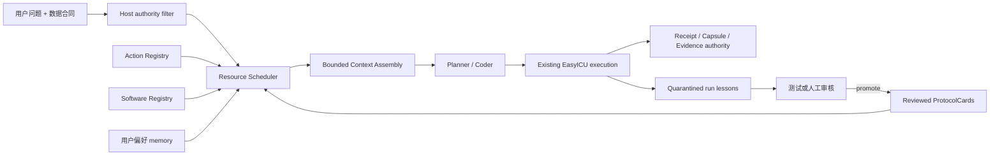

# EasyICU Research Agent：记忆、资源调度与 LangGraph 渐进接入计划

状态：`approved_design / implementation_not_started`
日期：2026-07-22
适用范围：Research Agent；不得改变患者数据、EvidenceStore、provider receipt、capsule 或 paper authority。

## 1. 决策

EasyICU 复用 LangChain/LangGraph 的通用运行原语，但不把科研权威交给通用 Agent 框架。

投稿前只完成两个能够直接提高可靠性或降低上下文负担的边界：

1. Host-owned Resource Scheduler：按任务/步骤选择少量 ProtocolCard、Action 和软件能力。
2. 分层长期记忆底座：用户偏好和已审核知识可读；运行经验先隔离，不能直接改变 canonical 科学计划。

投稿前不重写整个执行引擎，不把 `ResearchAgentPipeline` 改造成自由 ReAct Agent，也不允许运行中联网安装软件。LangGraph 的完整默认执行迁移放到 Canonical9 冻结后。

## 2. 当前基线

- `pyproject.toml` 已提供可选依赖 `langgraph>=1.0`。
- `research_agent/graph.py` 已有 opt-in `plan → execute → write → finalise` PoC，但没有 persistence/store/HITL，也不是默认路径。
- `planning/capability_registry.py` 已是分析族能力单一真相，但粒度是 family，不是逐步 Action/软件资源目录。
- Know-How v2 已有确定性检索、claim/citation、信任状态、Prompt 预算和 receipt；默认关闭。
- `learning/memory.py` 与 `learning/experience.py` 已实现跨 run 经验，但 canonical profile 正确地将其关闭。当前经验可直接进入 Planner，因此不适合作为投稿运行的默认科学输入。
- EasyICU 的 checkpoint、receipt、capsule、EvidenceStore 和 sandbox 是已验证权威，不迁入或复制到 LangGraph Store。

## 3. 目标结构



原则：Resource Scheduler 只能在 Host 已授权集合内排序；LLM 不能通过检索自行扩大科学权限。

## 4. Work package R0：冻结测量口径

只测量，不改变运行行为。

交付：

- 固定 Canonical9 九题的 Planner/Coder Prompt bytes、选中资源、provider calls 和 active wall 基线。
- 记录每个 Prompt 的分段字节：base、protocol、action、software、typed inputs、findings、history。
- 锁定当前 semantic golden、module graph、architecture baseline。

验收：

- 同一输入重复生成相同 measurement JSON。
- 不调用 provider，不读取历史 run 自由文本。

## 5. Work package R1：Resource Catalog 与确定性 Scheduler

新增统一 `ResourceDescriptor`：

```text
resource_id / version / sha256
kind: protocol | action | software | data
analysis_families
required_input_roles
produced_output_roles
permissions
review_status
prompt_projection
```

选择顺序：

1. Host 根据 analysis family、typed inputs、step role 和 profile 生成 allowlist。
2. 确定性检索只在 allowlist 内排序；允许返回 0 项。
3. 输出 `ResourceSelectionReceipt`，绑定 query、候选集合 SHA、选择理由、投影 SHA 和 Prompt 坐标。
4. Planner 最多 3 张 ProtocolCard；Coder 每步最多 8 个 Action schema、3 个 software capability。

投稿前不增加一次“LLM 资源选择调用”。未来可把 LangChain dynamic-tool middleware 作为可选 ranker，但 Host allowlist 永远先执行。

验收：

- Canonical9 离线 9/9：必要资源不漏、无关资源不选、允许零匹配。
- 相同坐标跨进程选择完全一致。
- 未审核卡、未批准软件、错误分析族资源均无法进入 Prompt。
- Scheduler 自身 0 provider calls。

## 6. Work package R2：有权限的长期记忆

定义 `MemoryStore` 接口，并提供：

- reference backend：当前 filesystem JSON/JSONL，便于回放。
- optional backend：LangGraph Store，负责 namespace/key/persistence，不负责科学审核。

命名空间：

| Namespace | 内容 | 可否影响 canonical 科学计划 |
|---|---|---|
| `preferences/<user>` | 语言、输出格式、常用数据库 | 仅非科学呈现偏好 |
| `reviewed_knowledge/<profile>` | 已审核 ProtocolCard/Action | 可以，必须 profile+SHA 固定 |
| `run_lessons/quarantine/<project>` | 自动提取的成功/失败经验 | 不可以 |
| `promoted_lessons/<version>` | 经测试或人工审核的通用经验 | 新 profile 下可以 |
| `runtime/<run_id>` | checkpoint 引用和 UI 连续性 | 不作为科学权威 |

每个 memory object 必须带：来源、producer、version、SHA、review status、适用范围、失效条件和 promotion receipt。

写入纪律：

- LLM 不得直接写入 reviewed/promoted namespace。
- 自动经验只能进入 quarantine。
- 从 quarantine 升级必须有通用回归测试或审核凭证。
- Canonical9 禁止读取 quarantine 和旧 `RunMemory`/`ExperienceBank` Planner digest。
- 同一 Prompt 中不得同时注入旧 memory digest 和新 memory object。

验收：

- 恶意/错误历史经验不能进入 canonical Prompt。
- memory 改变必须改变 profile/context SHA，旧 run 不得静默 resume。
- 关闭 memory 时与当前行为和 Prompt semantic golden 一致。

## 7. Work package R3：Bounded Context Assembly

Prompt 固定分区：

1. 短全局规则。
2. 当前步骤的科学/产物合同。
3. 选中的 reviewed Protocol claims。
4. 选中的 Action/software schema。
5. 当前 typed inputs。
6. 当前结构化 findings。
7. evidence/capsule 引用，不复制历史全文。

禁止字符串中间截断。超预算时按字段优先级丢弃低优先级说明；stop condition、authority、input identity、claim/citation、version/SHA 永不截断。无法在预算内保留权威字段则 fail-close。

投稿前目标：

- Planner 完整请求继续保持 `<80 KB` 硬门。
- 普通 Coder step 目标 `≤30 KB`；复杂模型 step 保持现有 `≤42 KB` 硬门。
- Resource Scheduler 不增加 provider call。
- 上下文大小不随 step 数线性增长。

## 8. Work package R4：受控的新方法/软件流程

用户提出新包或新方法时生成 `CapabilityRequest`：

```text
method / package / pinned version
scientific purpose
required inputs / outputs
license and source
validation tests
sandbox requirements
requester and approval
```

流程：request → human approval → isolated build → vulnerability/license check → focused validation → immutable image digest → capability registry。

硬边界：

- 在线分析容器无网络。
- Coder 不得执行 `pip install`、conda install 或任意 shell installer。
- 未注册能力 fail-close，并给用户可执行的 capability request，而不是伪装成“方法不支持”。

R4 不阻塞 Canonical9；先保留现有 `methods` extra 和 curated package contract。

## 9. Work package R5：LangGraph 默认运行迁移（Canonical9 后）

迁移方式不是重写业务逻辑，而是把现有 phase 作为节点：

```text
Plan → Acquire → ExecuteStep → Gate → Repair/Continue → Seal → Review → Finalise
```

- Graph state 只保存不可变 authority reference，不保存第二份 Evidence/current selector。
- LangGraph checkpointer 用于运行连续性和 HITL；EasyICU receipt/capsule 仍决定是否允许重放或付费。
- interrupt 用于 ProtocolCard、CapabilityRequest 和科学 stop condition 的人工确认。
- 新旧 dispatch 对同一录制输入做 shadow replay；产物 SHA、provider receipt 和终态一致后才切默认。

## 10. 执行顺序

### 投稿前（有界，最多三个独立提交）

1. R0：测量与资源选择 fixture。
2. R1+R3：确定性 Resource Scheduler + bounded context，先只接 Planner/Coder Prompt 装配。
3. R2：MemoryStore schema/namespace/policy；canonical 保持 quarantine memory OFF。
4. 离线 Canonical9 资源矩阵和固定响应 component replay 全绿。
5. 继续 E2/E3/H2，完成 9/9 development，冻结 commit/model/prompt/data/profile/retry policy。

停止条件：若任一提交需要额外资源选择 LLM 调用、改变科学 authority、引入循环依赖、破坏 golden，或不能在两个 focused commits 内形成完整边界，则不在投稿前启用。

### Canonical9 冻结后

1. R4 受控 capability workflow。
2. R5 LangGraph shadow migration。
3. B/C 冻结题比较：memory OFF vs reviewed/promoted memory ON。
4. SOFA-2 使用冻结框架，不把其结果反向用于调 Canonical9。

## 11. 最终验收

- 安全：0 个未审核资源/经验进入 canonical Prompt；0 次运行时联网安装。
- 可复现：resource/memory selection 全部有 digest receipt；同坐标跨进程一致。
- 效率：资源选择 0 LLM 调用；普通步骤 Prompt 目标 ≤30 KB；无 step-history 线性膨胀。
- 科学：Planner 的 exposure/outcome/cohort/method/estimand 权威不转移给 retriever 或 LangGraph。
- 泛化：A 题用于开发；冻结后 B/C 验证；SOFA-2 是独立 discovery vignette，不是调参题。
