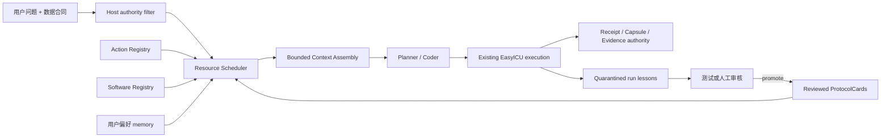

# EasyICU Research Agent：实验前完整架构优化计划（v2）

状态：`framework_v2_offline_release_passed / online_experiments_paused_pending_review`
日期：2026-07-22
适用范围：Research Agent；不得改变患者数据、EvidenceStore、provider receipt、capsule 或 paper authority。

## 1. 决策

EasyICU 复用 LangChain/LangGraph 的通用运行原语，但不把科研权威交给通用 Agent 框架。

用户最新决定：**九题实验全部暂停，先完成本文件定义的架构优化与离线发布门。** 不以“已有 PoC”或“已经能跑”为完成标准。

实验前完成六个有限边界：

1. 测量与架构基线。
2. Host-owned Resource Scheduler 与 bounded context。
3. 分层长期记忆及经验晋升机制。
4. Action/software/data 能力目录与受控 CapabilityRequest。
5. LangGraph 默认编排迁移及 HITL/persistence 接线。
6. 旧路径退役、减法清理和无 API 的九题离线发布验收。

不把 `ResearchAgentPipeline` 改造成自由 ReAct Agent，也不允许运行中联网安装软件。LangGraph 只编排现有职责节点，不接管 EasyICU 科学/证据 authority。新路径验收后必须删除或退役等价旧路径，不能长期维持两套实现。

### 1.1 2026-07-22 实施结果

| Bundle | 状态 | 提交 / 证据 |
|---|---|---|
| 0 测量冻结 | done | `2c77d49`；resource/context baseline |
| 1 统一资源与上下文 | done | `4fe8fea`、`c91b027`；Host allowlist、确定性选择、分段预算 |
| 2 安全长期记忆 | done | `447049b`、`dfcfcdd`；reviewed/promoted 才可影响计划，旧经验只进 quarantine |
| 3 能力与新方法入口 | done | `a34f7f7`；CapabilityRequest/approval/validation/image digest，不允许运行时安装 |
| 4 LangGraph 默认 runtime | done | `404710b`、`01cd41e`；唯一默认 phase runtime、digest-bound HITL 原语、旧 dispatch 退役 |
| 5 离线发布门 | done | `00c298e`；`task_logs/20260722_framework_v2_offline_release.json` |

离线发布门最终结果：resource/context、architecture、module graph、framework tests **4/4 通过**；框架专项 **85 passed**；**0 provider calls、0 patient-data reads**。这是 Framework v2 的离线发布候选，不是临床知识审核完成，也不是 Canonical9 或论文结果完成。所有在线实验继续暂停，等待独立审阅后由用户明确解冻。

## 2. 当前实现

- `langgraph>=1.0` 已成为基础 runtime 依赖；旧 `agentic` extra 保留为空的兼容入口。
- `research_agent/graph.py` 是唯一默认 `plan → execute → write → finalise` phase runtime；公共 `run_with_graph()` 仅为同一路径别名，不再保留直线 dispatch 分支。
- Graph 提供 digest-bound `HumanReviewRequest/Decision`、interrupt/resume 与可选 checkpointer。EasyICU 自有 checkpoint/receipt/capsule 仍是完整 pipeline 的持久连续性和科学权威；LangGraph checkpointer 不建立第二套 current/evidence authority。
- `planning/capability_registry.py` 已是分析族能力单一真相，但粒度是 family，不是逐步 Action/软件资源目录。
- Know-How v2 已有确定性检索、claim/citation、信任状态、Prompt 预算和 receipt；默认关闭。
- `resources/scheduler.py` 与 bounded context assembler 已统一投影 protocol/action/software/data；选择严格限制在 Host allowlist 内，允许 0 项且不增加 LLM 调用。
- `learning/store.py` 已建立 permissioned memory。旧 `RunMemory`/`ExperienceBank` 只作为兼容写源，产出镜像到 `run_lessons/quarantine`，不再直接进入 Planner；reviewed/promoted 对象必须有 profile、SHA 与 promotion/review receipt。
- `resources/capability.py` 已建立软件/新方法申请、人工批准、验证证据与不可变 image digest 的路径；它不执行安装。
- EasyICU 的 checkpoint、receipt、capsule、EvidenceStore 和 sandbox 是已验证权威，不迁入或复制到 LangGraph Store。

## 3. 目标结构



原则：Resource Scheduler 只能在 Host 已授权集合内排序；LLM 不能通过检索自行扩大科学权限。

## 4. Work package R0：冻结测量口径

只测量，不改变运行行为。

交付：

- 固定 Canonical9 九题的 Planner/Coder Prompt bytes、选中资源、provider calls 和 active wall 基线。
- 记录每个 Prompt 的分段字节：base、protocol、action、software、typed inputs、findings、history。
- 锁定当前 semantic golden、module graph、architecture baseline。

验收：

- 同一输入重复生成相同 measurement JSON。
- 不调用 provider，不读取历史 run 自由文本。

## 5. Work package R1：Resource Catalog 与确定性 Scheduler

新增统一 `ResourceDescriptor`：

```text
resource_id / version / sha256
kind: protocol | action | software | data
analysis_families
required_input_roles
produced_output_roles
permissions
review_status
prompt_projection
```

选择顺序：

1. Host 根据 analysis family、typed inputs、step role 和 profile 生成 allowlist。
2. 确定性检索只在 allowlist 内排序；允许返回 0 项。
3. 输出 `ResourceSelectionReceipt`，绑定 query、候选集合 SHA、选择理由、投影 SHA 和 Prompt 坐标。
4. Planner 最多 3 张 ProtocolCard；Coder 每步最多 8 个 Action schema、3 个 software capability。

投稿前不增加一次“LLM 资源选择调用”。未来可把 LangChain dynamic-tool middleware 作为可选 ranker，但 Host allowlist 永远先执行。

验收：

- Canonical9 离线 9/9：必要资源不漏、无关资源不选、允许零匹配。
- 相同坐标跨进程选择完全一致。
- 未审核卡、未批准软件、错误分析族资源均无法进入 Prompt。
- Scheduler 自身 0 provider calls。

## 6. Work package R2：有权限的长期记忆

定义 `MemoryStore` 接口，并提供：

- reference backend：当前 filesystem JSON/JSONL，便于回放。
- optional backend：LangGraph Store，负责 namespace/key/persistence，不负责科学审核。

命名空间：

| Namespace | 内容 | 可否影响 canonical 科学计划 |
|---|---|---|
| `preferences/<user>` | 语言、输出格式、常用数据库 | 仅非科学呈现偏好 |
| `reviewed_knowledge/<profile>` | 已审核 ProtocolCard/Action | 可以，必须 profile+SHA 固定 |
| `run_lessons/quarantine/<project>` | 自动提取的成功/失败经验 | 不可以 |
| `promoted_lessons/<version>` | 经测试或人工审核的通用经验 | 新 profile 下可以 |
| `runtime/<run_id>` | checkpoint 引用和 UI 连续性 | 不作为科学权威 |

每个 memory object 必须带：来源、producer、version、SHA、review status、适用范围、失效条件和 promotion receipt。

写入纪律：

- LLM 不得直接写入 reviewed/promoted namespace。
- 自动经验只能进入 quarantine。
- 从 quarantine 升级必须有通用回归测试或审核凭证。
- Canonical9 禁止读取 quarantine 和旧 `RunMemory`/`ExperienceBank` Planner digest。
- 同一 Prompt 中不得同时注入旧 memory digest 和新 memory object。

验收：

- 恶意/错误历史经验不能进入 canonical Prompt。
- memory 改变必须改变 profile/context SHA，旧 run 不得静默 resume。
- 关闭 memory 时与当前行为和 Prompt semantic golden 一致。

## 7. Work package R3：Bounded Context Assembly

Prompt 固定分区：

1. 短全局规则。
2. 当前步骤的科学/产物合同。
3. 选中的 reviewed Protocol claims。
4. 选中的 Action/software schema。
5. 当前 typed inputs。
6. 当前结构化 findings。
7. evidence/capsule 引用，不复制历史全文。

禁止字符串中间截断。超预算时按字段优先级丢弃低优先级说明；stop condition、authority、input identity、claim/citation、version/SHA 永不截断。无法在预算内保留权威字段则 fail-close。

投稿前目标：

- Planner 完整请求继续保持 `<80 KB` 硬门。
- 普通 Coder step 目标 `≤30 KB`；复杂模型 step 保持现有 `≤42 KB` 硬门。
- Resource Scheduler 不增加 provider call。
- 上下文大小不随 step 数线性增长。

## 8. Work package R4：Action/Software/Data 资源面与受控的新方法流程

用户提出新包或新方法时生成 `CapabilityRequest`：

```text
method / package / pinned version
scientific purpose
required inputs / outputs
license and source
validation tests
sandbox requirements
requester and approval
```

统一资源面包含：

- Action：Table 1、missingness、typed input、模型诊断、图件等经过测试的动作 schema。
- Software：当前环境已安装、版本固定、可在沙盒内调用的 Python/R 包。
- Data：用户已提供并经过 fingerprint/typed contract 的本地数据库或导出。

新增方法流程：request → human approval → isolated build → vulnerability/license check → focused validation → immutable image digest → capability registry。

硬边界：

- 在线分析容器无网络。
- Coder 不得执行 `pip install`、conda install 或任意 shell installer。
- 未注册能力 fail-close，并给用户可执行的 capability request，而不是伪装成“方法不支持”。

实验前完成 CapabilityRequest、批准状态、版本/镜像绑定和 fail-closed 响应；不要求在实验前扩充大量包或数据库。框架必须证明用户申请一个新方法时有明确入口，而不是让 Coder 临时安装。

## 9. Work package R5：LangGraph 默认运行迁移（已完成）

迁移方式不是重写业务逻辑，而是把现有 phase 作为节点：

```text
Plan → Acquire → ExecuteStep → Gate → Repair/Continue → Seal → Review → Finalise
```

- Graph state 只保存不可变 authority reference，不保存第二份 Evidence/current selector。
- LangGraph checkpointer 可用于可序列化的 HITL 流；完整研究运行继续由 EasyICU checkpoint 提供持久连续性，receipt/capsule 决定是否允许重放或付费。
- digest-bound interrupt 原语覆盖 ProtocolCard、CapabilityRequest 和科学 stop condition 的人工确认类型；尚未审核的资源不会因缺少 UI 自动确认而进入 canonical 计划。
- 默认 phase graph 已通过录制 golden；旧 `_use_graph` 分叉和直线 dispatch 已删除。
- 公共 CLI/API 只保留一个默认运行面，并写入 `orchestration_runtime.json`。生产 UI 对各类审核请求的展示属于后续产品接线，不是新的科学 authority。

## 10. Work package R6：减法清理与离线发布门（已完成）

必须完成的退役决策：

- 旧 `RunMemory`/`ExperienceBank` 不再直接拼接 Planner Prompt；迁入 quarantine adapter 后删除旧注入路径。
- Know-How、Action、Software 统一由 Resource Scheduler 投影；不再分别向 `notes` 或通用 context 重复注入。
- `graph.py` 的 PoC 只能升级为默认 runtime 或删除，不能继续作为第二执行路径。
- 删除无生产入口、无公共 API 承诺、无归档复现需要的内部兼容代码；公共兼容面必须有明确 retirement 记录。
- benchmark/论文包装不得反向 import 核心运行层。

离线发布门：

- Canonical9 九个 A 题全部完成 resource-selection fixture，不调用 provider。
- 固定 Planner/Coder 响应做 component replay，覆盖 plan、execute、gate、repair、seal、resume、HITL。
- 恶意 memory、错误工具、未批准软件、Prompt overflow、checkpoint 篡改和旧 receipt 重放均 fail-close。
- architecture baseline、zero-SCC、semantic golden、module graph 全绿。

最终由 `tools/research_agent_framework_release.py` 固化为单一无网络发布命令；报告包含工具 SHA、逐门命令、return code 与 stdout/stderr SHA。2026-07-22 权威结果为 4/4 门通过、85 项专项测试通过、0 provider calls、0 patient-data reads。

结构数字要求：

- 顶层 `research_agent/*.py` 不高于当前 21 个，禁止新增新顶层实现文件。
- module graph 保持 0 cyclic modules / 0 SCC。
- `execution/phase.py`、`pipeline.py` 不得增长；新增实现必须同步删除重复旧路径。
- Resource/Memory/Runtime 三个边界各只有一个生产入口、一个 schema 和一个 receipt 体系。
- 生产代码净增长必须有逐项说明；仅“增加抽象层”不算完成。

## 11. 执行顺序

### Bundle 0：测量冻结（R0）

- 1 个提交：九题 Prompt 分段、资源选择、调用与架构基线。
- 不改行为、不调用 API。

### Bundle 1：统一资源与上下文（R1+R3）

- 2–3 个提交：schema/catalog/receipt → deterministic scheduler → Planner/Coder context 接线并删除旧重复注入。
- 九题离线资源矩阵、Prompt budget、negative controls 全绿。

### Bundle 2：安全长期记忆（R2）

- 2–3 个提交：Memory schema/policy → filesystem/LangGraph Store adapters → 旧 memory 注入退役。
- canonical 只读 preferences 与 reviewed knowledge；quarantine experience 永不进入科学 Prompt。

### Bundle 3：能力与新方法入口（R4）

- 2 个提交：Action/software/data descriptors → CapabilityRequest/approval/image binding。
- 不大规模增加工具；完成“已有能力按需暴露、缺失能力可申请”的通用路径。

### Bundle 4：LangGraph 默认 runtime（R5）

- 2–3 个提交：显式 phase/step graph → checkpoint/interrupt → shadow equivalence → 默认切换并删旧重复 dispatch。
- Graph state 只持 authority references。

### Bundle 5：减法与离线发布（R6）

- 1–3 个提交：删除旧注入/PoC/死路径，完成九题固定响应 replay、对抗门和结构数字验收。
- 形成唯一 framework-freeze commit、profile、Prompt pack、resource catalog 和 memory policy。

### 实验解冻

1. fresh 跑 Canonical9 A；框架 bug 必须先由离线 fixture 复现才允许修。
2. A 完成后冻结，不再用 A 结果改共享框架。
3. B/C 验证泛化与 memory OFF/ON。
4. SOFA-2 使用冻结框架；不把 SOFA-2 变成第十个调参题。

实际规模：6 个 bundle、9 个核心实现/发布提交，另 1 个兼容经验隔离收口提交。离线 Framework v2 已完成；实验仍须在独立审阅和用户解冻后进行。

停止条件：任何 bundle 若新增科学 authority、需要额外资源选择 LLM 调用、引入循环、破坏 golden，或只是把旧逻辑复制进新文件而未删除旧入口，则拒收并回到上一个可收提交。

## 12. 最终验收

- 安全：0 个未审核资源/经验进入 canonical Prompt；0 次运行时联网安装。
- 可复现：resource/memory selection 全部有 digest receipt；同坐标跨进程一致。
- 效率：资源选择 0 LLM 调用；普通步骤 Prompt 目标 ≤30 KB；无 step-history 线性膨胀。
- 科学：Planner 的 exposure/outcome/cohort/method/estimand 权威不转移给 retriever 或 LangGraph。
- 结构：无双 memory、双 context assembler、双 runtime 或双 capability truth；旧路径确实删除。
- 泛化：架构先由离线九题和对抗 fixture 验收；fresh A 题只做在线验证，冻结后 B/C 验证；SOFA-2 是独立 discovery vignette，不是调参题。

### 12.1 已通过与未宣称

已通过：安全资源选择、bounded context、permissioned memory、CapabilityRequest、默认 LangGraph phase runtime、digest-bound HITL 原语、旧经验隔离、semantic golden、architecture/module graph 与离线发布门。

未宣称：ProtocolCard 已完成临床/方法学签署；已建设 Biomni 规模的 Action/软件/数据库目录；所有产品 UI 已接入 HITL；Canonical9 在线 A 或 B/C 泛化已经通过；任何结果获得 paper authority。这些项目不能用本次离线发布报告替代。
