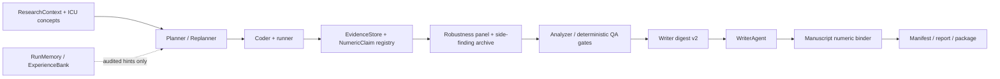

# EasyICU Research Agent Module Map

Drafted 2026-05-27 for the npj Digital Medicine engineering audit.

The research agent is intentionally not a free-form SQL agent. Its
submission-facing claim is a clinically constrained research-agent
platform: LLMs choose analysis steps, write code, repair failures, and
draft prose inside ICU concept rails, deterministic gates, and
value-level evidence binding.

## Layer 1: Core Clinical Runtime

- `src/easyicu/research_agent/context.py` and `schema.py` define the
  typed research context, analysis plan, findings, evidence refs, and
  manifest schema.
- `src/easyicu/research_agent/icu_semantics.py`, `cohort_audit.py`,
  `concept_usage_auditor.py`, and the concept dictionary protect the
  clinical meaning of cohorts and variables. These are clinician /
  engineer curated rules, not writable agent memory.
- `src/easyicu/research_agent/runners.py` and `pipeline_execute.py`
  execute generated code in the configured runner and register each
  step artefact.

## Layer 2: Agent Roles

- Planning: `PlannerAgent`, `ReplannerAgent`, hypothesis blueprint
  helpers, and optional literature/context retrieval decide the
  step-level analytical shape.
- Execution: `CoderAgent` writes code, repair loops revise failed code,
  and deterministic runner repair handles narrow known failure modes.
- Writing: `WriterAgent` receives a compact evidence digest and writes
  manuscript prose that must bind back to registered evidence.
- Review: `AnalyzerAgent`, `CriticAgent`, visual QA, reporting
  checklist, fairness, causal audit, and readiness gates evaluate
  results before packaging.

Deterministic validators are deliberately described as QA gates, not
as autonomous agent novelty.

## Layer 3: Evidence And Numeric Provenance

- `evidence.py` owns content-hashed artefacts and the `NumericClaim`
  registry.
- `pipeline_writer_aux.py` builds the writer digest. The v2 digest has
  primary numbers, secondary numbers, and formula-registered derived
  numbers.
- `robustness_panel.py` owns pre-specified robustness specifications
  and the run-level `robustness_panel.json` disclosure artefact. The
  writer sees only panel summaries, not raw variant rows.
- `side_findings.py` archives appendix-only observations in
  `side_findings.md`. These observations are excluded from writer
  digests and are blocked if they leak into strict-mode manuscripts.
- `manuscript_post.py` binds manuscript numbers back to claims and
  appends value-level footnotes. In strict mode, untraced numbers,
  forbidden post-hoc wording, and side-finding leakage fail the run
  instead of being silently repaired.

## Layer 4: Optional Extensions

- `memory.py` is the historical run-memory digest.
- `experience.py` is the HealthFlow-inspired, audit-safe experience
  bank. It only admits `concept_usage_hint` and
  `failure_counter_example` records and never creates ICU rules.
- Literature retrieval, VLM visual QA, LaTeX/PDF export, publication
  figures, and Docker runners are optional modules controlled by
  pipeline configuration.

## Layer 5: Evaluation And Submission Scaffold

- `tools/run_research_agent_bench.py` keeps historical `naive` /
  `aware` ablation support, but the submission profile requires
  `--arms aware`.
- `baselines/REGISTRY.md` lists comparison projects; `baselines/LOCK.json`
  freezes paper-cited baselines to exact commits.
- The canonical submission profile enables strict evidence, widened
  writer digest, and the reproducibility envelope.

