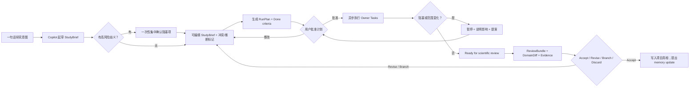

# EasyICU Copilot 交互参考研究：从聊天向导到研究工作台

> 日期：2026-07-29  
> 模块：web / Copilot  
> 状态：只读产品研究；未修改 EasyICU 产品源代码  
> 目标受众：临床研究者、ICU 数据研究者、数据分析师，以及不希望先学习数据库/流水线细节的研究负责人  
> 时间范围：优先服务下一轮桌面/笔记本 Web 交互迭代；不包含移动端  
> 研究范围：交互架构、研究状态、审批边界、运行与科学审阅；不在本轮决定视觉风格或后端实现

## Executive read

EasyICU Copilot 当前最核心的问题，不是缺少聊天能力，也不是缺少功能，而是**研究状态主要由聊天记录承载**。用户需要从对话、进度数字和临时卡片中反推：

- 研究问题现在被理解成什么；
- 哪些设置是用户明确确认的，哪些是 Copilot 推断的；
- 当前为什么不能运行；
- 运行后改变了什么；
- 哪些结果已经通过数据与证据门，哪些仍待人工审阅；
- 修改一个队列、结局或时间窗后，能否保留原方案并形成可比较分支。

成熟的 agent 产品和科研工具正在收敛到同一基本模型：

> **Project → editable Plan → leaveable Run → reviewable Artifact → explicit Accept**

聊天仍然重要，但它更适合作为**命令与解释界面**，而不是工作本身。对 EasyICU 更合适的产品方向是：

> **由对话驱动、但由研究对象和证据 artifact 承载状态的 Research Cockpit。**

当前三栏壳不必推倒重做。建议保留外层布局，但重新分配主次：

- 左栏从“聊天项目列表”改成“研究对象与阶段”；
- 中栏从“聊天时间线”改成“当前研究对象画布”；
- 右栏从“0/8 进度”改成“计划、阻塞、运行和科学审阅队列”；
- 对话框收成可展开的命令栏，并明确 `咨询 / 设计研究 / 执行` 三种模式。

## 当前产品诊断

### 已观察事实

1. 当前 Guided/Copilot 已有三栏结构、目标卡、内联配置、项目文件夹记忆、运行进度和模块 handoff，并非一个纯问答聊天框。
2. 代表性桌面截图 `output/ui-qa/20260729_web_review/02-guided-start-viewport.png` 中：
   - 左栏项目项大量使用“运行研究项目”等通用名称，并把原始路径放在高显著位置；
   - 中栏由对话和目标选择主导；
   - 右栏主要是 `0/8` 式阶段进度，缺少可编辑计划、完成定义和待审阅结果。
3. `src/easyicu/webserver/static/js/screens-guided.js` 当前为 5,789 行；同一闭包持有大量对话、项目、配置、运行、审阅和模块 handoff 状态。
4. 当前已经存在 goal cards、chips、配置步骤和 job progress，因此问题不能简单归因于“缺少结构化 UI”。

### 产品推断

当前困难来自**交互层级与状态模型**：

1. **聊天拥有研究状态。** Research Brief、配置与结果虽会以卡片出现，但大多仍嵌在聊天时间线里，难以形成长期可审阅的单一真相。
2. **配置像“聊天里的表单”。** 用户依次回答多个 slot，但无法在一个稳定页面里看到完整协议、冲突、推断来源和未决项。
3. **计划、运行、结果之间没有足够清晰的批准边界。** “下一步会发生什么”“会访问什么数据”“完成长什么样”不够可预测。
4. **缺少研究语义的 diff、branch 和 checkpoint。** 研究者真正关心的是队列、结局、时间窗、变量、模型和样本量如何改变，而不是通用文件 diff 或完整 agent 日志。
5. **右栏表达流程，而非决策。** 研究任务不是完成 8 个表单步骤；关键是哪些决定已冻结、哪里被数据阻塞、什么结果等待科学审阅。
6. **项目列表缺少可恢复上下文。** 用户返回时更需要看到研究名、当前阶段、状态、下一项决定，而不是通用动作名和磁盘路径。

## 参考项目：它们如何设计 agent 交互

下表中的“观察”来自官方产品说明、文档或官方代码库；“EasyICU 启示”为本轮产品推断。

| 项目 | 官方设计观察 | EasyICU 可借鉴 | 不应照搬 |
|---|---|---|---|
| [Elicit Research Agent](https://elicit.com/blog/introducing-research-agent-workflows) / [Elicit Reports](https://elicit.com/blog/introducing-elicit-reports) | 先选择研究 workflow 与期望输出；运行前就来源、边界和产物提澄清问题；用户可以检查和编辑中间步骤、支持性原文与研究方法。 | 最接近 EasyICU。建立可编辑的 `Living Study / Study Brief`，并让 claim 能回溯到数据、分析、证据和决策。 | 不要把文献筛选的线性阶段原样套到 ICU 数据研究；EasyICU 还要表达队列、时间锚点、导出与统计门。 |
| [OpenAI Deep Research](https://help.openai.com/en/articles/10500283-deep-research-in-chatgpt) | 用户先限定来源；系统提出可编辑计划；运行中显示进度，允许中断、补充方向和调整来源；完成后提供带目录、来源和活动历史的报告与导出。 | 在昂贵执行前显示 `Study Plan`，允许暂停/改计划；运行结束进入完整审阅 bundle，而不是发一条“已完成”消息。 | 不要把“搜索网站”式 source picker 直接等同于 ICU 数据权限；EasyICU 的来源范围必须绑定数据库、export、数据版本和权限。 |
| [Deepnote Agent](https://deepnote.com/docs/deepnote-agent) | 明确区分 Ask 与 Edit；执行前给出计划，操作逐步可见；用户能阻止某个动作、查看前后变化并撤销整次 run；notebook 是持久工作画布。 | 采用 `咨询 / 设计研究 / 执行` 模式；提供研究语义 diff 与整次 run 的撤销/废弃。 | 不向普通研究用户暴露完整 notebook cell 或实现级 diff；默认显示 cohort N、变量、时间窗、分析和 evidence gate 变化。 |
| [Microsoft Data Formulator](https://github.com/microsoft/data-formulator) / [官方设计说明](https://www.microsoft.com/en-us/research/blog/data-formulator-exploring-how-ai-can-help-analysts-create-rich-data-visualizations/) | 把自然语言与直接操作 UI 混合；用户可检查原始/衍生数据与 lineage；Data Threads 支持追问、修改、重跑和分支。 | 为同一研究建立 `Study Thread`；在队列、结局或时间窗处 branch，而不是重开一段聊天。配置既能对话修改，也能直接编辑。 | 不把 ICU 研究简化成图表创作；可视化只是 ReviewBundle 的一个 artifact。 |
| [Replit Agent task system](https://docs.replit.com/core-concepts/agent/task-system) / [Codex](https://openai.com/index/introducing-the-codex-app/) | 任务在执行前定义“done looks like”；可后台运行；产物进入 review/apply 流程；项目线程、隔离分支、diff 和 review queue 是一级对象。 | 将研究步骤表达成有完成条件的 task DAG；异步运行结束后进入 `Ready for scientific review`，由用户 accept、revise、branch 或 discard。 | 不直接复制软件 Kanban，也不把依赖性强的科学步骤任意并行。研究设计冻结前，队列、结局与时间锚必须保持依赖顺序。 |
| [Hex Threads](https://hex.tech/product/threads/) | 对话使用受信 semantic layer；每个结果都能打开到底层 notebook/project，图表和表格可继续探索。 | 每个 Copilot artifact 都可进入 Data Extraction、Patient、Cohort、Cross-DB 或 Agent 原生 owner 页面，并把修改 round-trip 回 Copilot 项目记忆。 | 不另造一套重复执行引擎；Copilot 应编排 owner，而不是复制 owner。 |
| [FutureHouse](https://www.futurehouse.org/news/launching-futurehouse-platform-ai-agents) / [PaperQA2](https://github.com/Future-House/paper-qa) | 专项 agent 在后台分工；来源检索、证据聚合和答案生成可追踪；PaperQA 明确 Search → Gather Evidence → Generate Answer。 | 后端仍可使用专门 owner/agent，但前台只展示一条统一研究计划与 evidence lineage。 | 不让用户先选择一串 agent 人设；临床研究者更需要能力、权限、输入和输出，而不是 agent 名称。 |
| [Consensus Deep Search](https://consensus.app/home/blog/deep-search/) / [Julius quickstart](https://julius.ai/docs/get-started/quickstart) | 前者区分快速搜索与深度结构化报告；后者用上传/连接数据 → 提问 → 图表/导出的低门槛路径降低首次使用成本。 | 首页可以提供低门槛的“问一个问题 / 设计研究 / 运行已批准研究”入口，逐步增加控制。 | 不用模型/供应商术语教育用户；也不能把一次聊天回答视为可直接进入论文的研究产物。 |

## 跨产品共性

### 1. 先给用户一个可审阅计划

成熟 agent 并不依赖用户提前写出完美 prompt。它先把意图变成可编辑计划，并明确：

- 理解了什么；
- 推断了什么；
- 哪些信息缺失；
- 将访问哪些资源；
- 将创建什么产物；
- 什么条件算完成；
- 哪些动作需要再次批准。

### 2. 长任务可以离开，但不能失去控制

后台运行的价值不是“炫耀 autonomously working”，而是用户可以：

- 离开页面后回来恢复；
- 看到当前任务和阻塞；
- 暂停、取消或调整后续步骤；
- 明确区分 partial、failed、blocked、ready for review 和 accepted。

### 3. 结果先进入审阅队列，而非直接进入项目真相

高质量 agent 产品普遍把产物放入 review/apply 流程。对于 EasyICU，运行成功只表示生成了候选结果，不等于研究结论已被接受，更不等于可以写入论文。

### 4. 用户审阅的是领域变化，不是内部日志

软件 agent 展示文件 diff；EasyICU 应展示：

- 队列分母从多少变成多少；
- 纳入/排除规则变了什么；
- 暴露、结局和时间窗变了什么；
- 新增/删除了哪些变量和模块；
- 统计分析与敏感性分析如何变化；
- 哪些证据门通过、阻塞或未知；
- 哪些结果是新生成、重用或失效。

### 5. 直接操作与自然语言共存

自然语言适合表达意图、提出解释请求和批量修改；稳定表单/画布适合核对完整状态。只使用其中一种都会增加澄清成本。

## 建议的 EasyICU 交互模型

### 产品主张

> EasyICU Copilot 不是“替研究者点击页面的聊天机器人”，而是一个能把研究意图编译为可审阅协议、可恢复执行与可追溯证据的研究工作台。

### 三种稳定模式

| 模式 | 用户预期 | 默认权限 |
|---|---|---|
| `咨询` | 解释概念、审阅已有 artifact、比较方案 | 只读；不得修改研究配置或运行任务 |
| `设计研究` | 创建/修改 Study Brief 与 Run Plan | 可提出配置变更；变更先作为 proposal |
| `执行` | 运行已批准计划、处理阻塞、生成审阅 bundle | 只执行被批准范围；扩大数据/外部访问/研究定义时重新批准 |

模式要稳定显示在输入区附近，避免用户猜“这句话会只是回答，还是会改配置并启动任务”。

### 五个一级研究对象

| 对象 | 内容 | 主要用户动作 |
|---|---|---|
| `StudyBrief` | purpose、data source/export、cohort、feature modules、exposure/outcome、time window、analysis goal、output、claim/evidence gate | 直接编辑、让 Copilot 修改、查看推断与冲突、批准 |
| `RunPlan` | task DAG、输入、权限、预计时间/成本、每步 done criteria、预期 artifacts | 调整顺序、禁用非必要步骤、批准执行 |
| `RunReceipt` | 数据快照、版本/digest、分母、实际模块、门控结果、失败原因、重用状态 | 查看来源、定位 owner、重试或修复阻塞 |
| `DomainDiff` | cohort、规则、变量、时间窗、分析、分母和证据状态的前后变化 | 接受、撤销、从当前点分支 |
| `ReviewBundle` | Findings、Figures/Tables、Methods、Evidence、Issues | 逐项接受、请求修订、分支重跑、拒绝 |

这些对象应是 Copilot 和原生模块之间的小型 typed contract；Copilot 不复制 Data Extraction、Idea Mining 或 Agent 的执行逻辑。

### 推荐流程

## 复用现有三栏壳

### 左栏：Projects → Research objects

每个项目项优先显示：

- 研究名，例如“SOFA-2 变化与 ICU 死亡”；
- 当前阶段，例如“设计研究 / 数据准备 / 运行 / 科学审阅”；
- 状态，例如“2 项待确认”“运行中 4/7”“待审阅”；
- 下一决定，例如“确认 index time”。

原始磁盘路径放到二级详情，不占主标签。

### 中栏：Chat timeline → Active artifact canvas

默认显示当前最需要用户处理的对象：

- 新项目：`StudyBrief`；
- 计划未批准：`RunPlan`；
- 运行中：当前 task 与 receipt；
- 运行结束：`ReviewBundle`。

聊天消息仍保留在可展开的“对话与决策历史”里，但不再是默认画布。

### 右栏：0/8 progress → Plan / Activity / Review

右栏建议三 tab：

1. `Plan`：task DAG、依赖、done criteria；
2. `Activity`：当前动作、暂停/取消、重要 receipt；
3. `Review`：待接受 findings、figures、methods、issues。

右栏只显示与当前研究对象有关的状态，不倾倒内部 chain-of-thought 或全量工具日志。

### 底部：Composer → Conversational command bar

输入框左侧显示模式，右侧显示作用域 chips，例如：

- `@StudyBrief`
- `@Cohort`
- `@Outcome`
- `@CurrentRun`
- `@Finding-3`

用户可以说“把 28 天死亡改成住院死亡”，也可以直接打开 `Outcome` 字段修改；两条路径生成同一个 proposal 和 DomainDiff。

## 审批与权限边界

不需要每一步都弹确认。建议只在四类真正改变研究风险或成本的边界确认：

1. **数据激活与外部访问**：首次访问某数据库/export、扩大目录、调用外部服务或发送可识别上下文；
2. **研究定义冻结**：队列、结局、时间锚点、核心变量与主要分析；
3. **昂贵或写入型执行**：长时分析、批量导出、覆盖/新增持久 artifact；
4. **证据接受与传播**：结果写入项目记忆、导出报告、进入 manuscript 或对外分享。

其余低风险操作可在已批准 plan 内自动运行，但必须：

- 保持可取消；
- 产出 receipt；
- 扩大 scope 时 fail closed；
- 运行结果先进入 review，不自动进入项目真相。

## 不建议照搬的模式

1. **不要做纯聊天首页。** 对临床研究，长期状态和审批不能埋在聊天历史。
2. **不要做通用 Kanban。** 科学步骤有依赖、冻结点和 evidence gate，不能任意拖拽并行。
3. **不要让用户选择内部 agent 人设。** 前台应选择目标、能力与权限；后台 owner 由系统路由。
4. **不要默认 30 秒后自动执行。** 医疗研究的 silent auto-run 会破坏可预测性。
5. **不要自动把所有对话写入项目记忆。** 只把用户接受的 artifact 或 memory proposal 写入。
6. **不要用“运行完成”代替“科学上可接受”。** 必须独立表达 run terminal state 与 evidence/review state。
7. **不要以 Yes/No 结论强度取代证据检查。** ICU 观察性研究更需要 denominator、bias、missingness、sensitivity 与 lineage。

## 分阶段机会图

### 本周可验证：不改后端执行模型的交互原型

先用现有 API、slot 与 handoff，做三项高杠杆调整：

1. **稳定模式**：在 composer 上方固定 `咨询 / 设计研究 / 执行`，让权限和行为可预测；
2. **可编辑 Study Brief**：把当前分散 slot 汇总成持久主画布，标记 `用户确认 / Copilot 推断 / 缺失 / 冲突`；
3. **科学审阅面板**：把 terminal result 显示为 `Ready for scientific review`，提供 receipt、DomainDiff 与 `接受 / 修订重跑 / 分支 / 废弃`。

这一阶段的目的不是把所有按钮做完，而是验证新的状态层级是否比 chat-first 更易理解。

### 本季度：形成真正的 Research Cockpit

1. 定义 `StudyBrief`、`RunPlan`、`RunReceipt`、`DomainDiff`、`ReviewBundle` 小型 typed contracts；
2. 让 plan 成为带依赖和 done criteria 的 task DAG；
3. 支持持久异步运行、离开/返回、暂停、取消与 fail-closed scope expansion；
4. 增加研究语义 branch/checkpoint，对不同 cohort/outcome/window 做并列比较；
5. 项目记忆改为 proposal-based update，只有 accepted artifact 能成为项目真相；
6. 原生模块支持从 Copilot 带预填状态进入，并把修改 round-trip 回同一研究对象。

### 需要进一步研究

用 5–8 名 ICU 研究用户完成任务式可用性测试，至少覆盖：

- 从一句话目标得到可运行计划；
- 发现并修正错误 outcome/time anchor；
- 离开长任务后恢复；
- 判断一个 result 是否只是运行成功，还是已通过科学审阅；
- 从主方案创建 sensitivity branch；
- 从 finding 回溯到 cohort、分析、数据和证据。

## 可用性度量

本轮不凭空设定最终 KPI；先记录基线，再验证以下方向性假设：

| 指标 | 定义 | 期望方向 |
|---|---|---|
| Time to valid plan | 从首次输入到用户能正确复述并批准完整 StudyBrief/RunPlan | 降低 |
| Clarification turns | 达到可批准计划前的来回轮数 | 降低，但不能以漏问高风险信息为代价 |
| Next-step predictability | 用户是否能在点击前说出下一步会发生什么、会访问什么、会产生什么 | 提高 |
| Configuration correction rate | 运行前发现并修正 cohort/outcome/window 错误的比例 | 提高 |
| Resume success | 离开后能否在 30 秒内定位当前状态、阻塞和下一决定 | 提高 |
| Evidence inspection rate | 接受 finding 前查看 denominator、receipt 或 evidence lineage 的比例 | 提高 |
| Unsafe acceptance | evidence blocked/unknown 时仍被误接受为正式结果 | 接近 0 |
| Restart cost | 修改一个核心定义后需要重建多少无关上下文 | 降低 |

## 建议的低保真比较方向

下一步适合一次生成三套、同一现有视觉语言下的低保真方向：

1. **Living Study**：中栏始终以 StudyBrief 为核心，适合优先解决配置与理解；
2. **Task Cockpit**：中栏突出 plan/run/review 状态，适合复杂异步流程；
3. **Artifact-first**：中栏优先展示 findings/figures/methods 与 lineage，适合结果审阅和论文衔接。

推荐不是三选一后永久放弃其他模式，而是先判断哪一种应成为默认信息层级。初步判断：**Living Study 作为新项目默认，Task Cockpit 作为运行态，Artifact-first 作为审阅态**最符合 EasyICU 的完整生命周期。

## Source map 与置信度

| 结论 | 主要来源 | 类型 | 置信度 |
|---|---|---|---|
| 科研 agent 应让用户检查中间步骤、来源与支持证据 | Elicit Research Agent / Reports、PaperQA2 | 官方产品说明 + 官方代码库 | 高 |
| 长任务应先展示可编辑计划，并支持中断、恢复和审阅 | OpenAI Deep Research、Replit task system、Codex | 官方文档/产品说明 | 高 |
| Ask/Edit 或咨询/执行权限应显式 | Deepnote Agent | 官方文档 | 高 |
| 自然语言应与直接操作、lineage 和 branch 结合 | Data Formulator、Hex Threads | 官方研究团队说明/产品页 | 高 |
| EasyICU 的主要问题是 chat-first 状态层级 | 当前截图、`screens-guided.js` 结构与已有交互 | 本地产品观察后的推断 | 中高 |
| Living Study + Task Cockpit + Artifact Review 是最佳最终组合 | 上述竞品共性与 EasyICU 科学边界的综合推断 | 产品设计推断 | 中；需低保真任务测试验证 |

## 结论

EasyICU 不需要再把 Copilot 做成“更长、更会追问的聊天”。真正的升级是把聊天从**状态容器**降为**命令与解释层**，把 StudyBrief、Plan、Receipt、Diff 和 ReviewBundle 升为可编辑、可恢复、可分支、可审阅的一等对象。

这既能复用当前三栏壳和后端 owner，也能更符合 ICU 科研对可追溯、可审批和 fail-closed 的要求。
